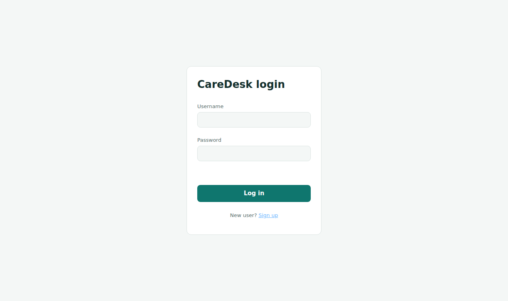
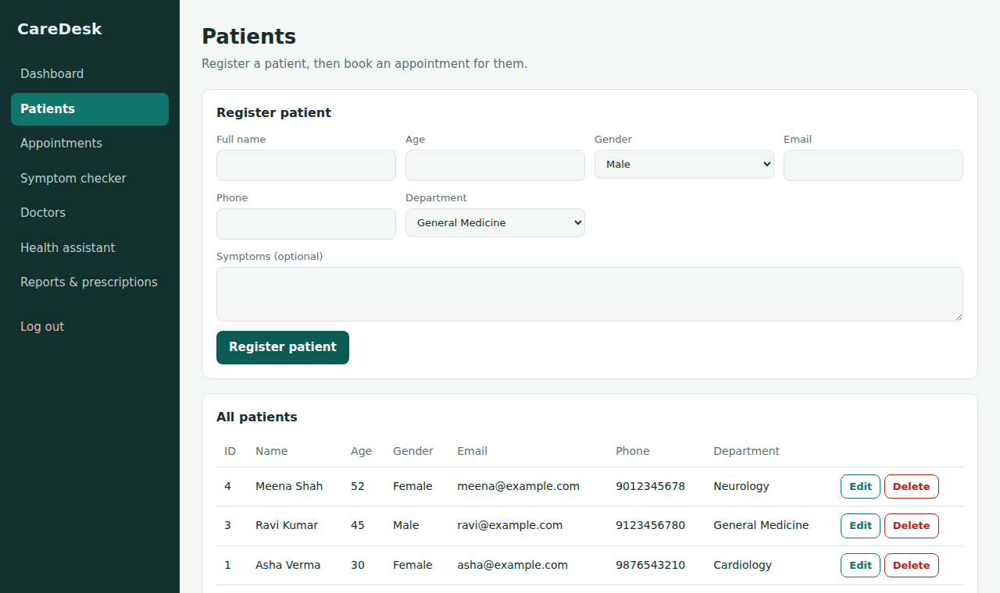
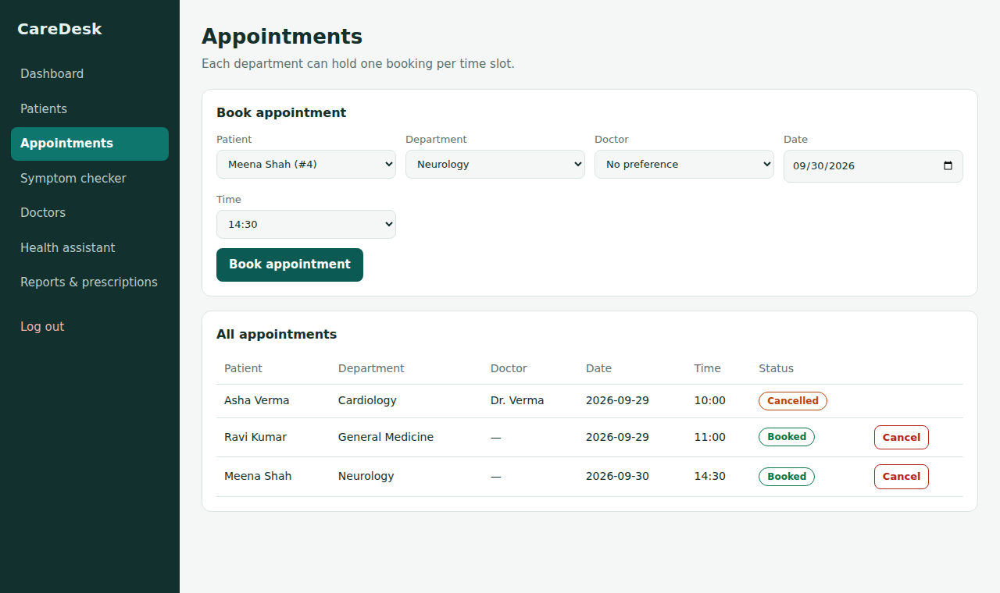

# CareDesk - Healthcare Automation

CareDesk is a web application for a small clinic. Staff members can sign up, log in, register patients,
book appointments and manage doctors. It also has simple AI tools such as a symptom checker,
a health assistant, a report summarizer and a prescription reader.

This project has a **frontend**, a **Python backend** and a **database**.

| Part      | Technology                     | File                  |
|-----------|--------------------------------|-----------------------|
| Frontend  | HTML, CSS, JavaScript          | `frontend/index.html` |
| Backend   | Python, FastAPI                | `main.py`             |
| Database  | SQLite (created automatically) | `database.py`         |
| AI tools  | Ollama (llama3.2), Tesseract   | `ai_service.py`       |

## Screenshots

| Login page | Patients page |
|------------|---------------|
|  |  |



## Features

- Sign up and log in. Only registered users can use the app.
- Passwords are saved as salted hashes, never as plain text.
- Patients: add, view, edit and delete. All data is saved in the database.
- Appointments: book, view and cancel. The same department cannot be booked twice at the same time.
- Doctors: add, view and remove.
- Dashboard with live numbers from the database.
- Admin page that shows all registered users (id, username and signup time).
- Change password option.
- AI tools: symptom checker, health assistant, report summary, prescription explanation.

## Project structure

```
CareDesk/
|-- main.py                 API routes (FastAPI)
|-- database.py             All database code (SQLite)
|-- ai_service.py           AI and OCR helper functions
|-- config.py               Reads settings from the .env file
|-- frontend/
|   `-- index.html          The user interface
|-- tests/
|   `-- test_app.py         Automatic tests
|-- docs/screenshots/       Images used in this README
|-- requirements.txt        Packages needed to run the app
|-- requirements-dev.txt    Extra packages needed to run the tests
|-- .env.example            Example settings file
|-- run.bat                 One-click start for Windows
`-- README.md
```

## What you need first

- Python 3.10 or newer (download from https://www.python.org).
  During installation on Windows, tick **"Add Python to PATH"**.
- The AI tools are optional. The rest of the app works without them (see the last section).

## How to run (step by step)

### Step 1: Download the project
```
git clone <your-repository-link>
cd <project-folder>
```
Or download the ZIP from GitHub and extract it.

### Step 2: Create a virtual environment (recommended)
```
python -m venv venv
```
Activate it:
```
venv\Scripts\activate          # Windows
source venv/bin/activate       # Mac and Linux
```

### Step 3: Install the packages
```
pip install -r requirements.txt
```

### Step 4: Create your settings file
Copy the file `.env.example` and name the copy `.env`.
```
copy .env.example .env         # Windows
cp .env.example .env           # Mac and Linux
```
Open `.env` in any text editor and set your own admin password:
```
ADMIN_USERNAME=admin
ADMIN_PASSWORD=your-own-password
```
The admin account is created from these values the first time the app starts.
(If you leave `ADMIN_PASSWORD` empty, the app creates a random password and prints it in the terminal.)

### Step 5: Start the server
```
uvicorn main:app --reload
```
On Windows you can also just double-click `run.bat`. It does steps 3, 4 and 5 for you.

### Step 6: Open the app
Open your browser and go to:

- App: http://localhost:8000
- API documentation: http://localhost:8000/docs

The database file `healthcare.db` is created automatically the first time you start the server.

## How to use the app

1. On the login page click **Sign up**. Type a username and a password (at least 6 characters) and click **Create account**.
2. Log in with the same username and password.
3. Open **Doctors** to see or add doctors.
4. Open **Patients**, fill in the form and click **Register patient**. Use **Edit** or **Delete** in the table to change a patient.
5. Open **Appointments**, choose a patient, department, date and time, then click **Book appointment**.
6. Use **Change password** on the Dashboard to change your password.
7. To see all registered users, log in with the admin account and click **Users (admin)** in the left menu.

## Optional: AI tools

The symptom checker, health assistant and report summary need Ollama. The prescription image reader needs Tesseract.
If they are not installed, the app still works and shows a clear message on those pages.

1. Install Ollama from https://ollama.com
2. Download the model: `ollama pull llama3.2`
3. Keep Ollama running: `ollama serve`
4. For prescription images, install Tesseract:
   - Windows: https://github.com/UB-Mannheim/tesseract/wiki
   - Linux: `sudo apt install tesseract-ocr`
   - Mac: `brew install tesseract`

The Dashboard has a "System status" box that shows if Ollama and Tesseract are ready.

Optional settings (environment variables): `OLLAMA_URL`, `OLLAMA_MODEL`, `TESSERACT_CMD`.

## Run the tests

```
pip install -r requirements-dev.txt
pytest -q
```
The tests use a temporary database, so your real data is not touched.

## Main API routes

| Method | Route                          | What it does                    |
|--------|--------------------------------|---------------------------------|
| POST   | `/auth/signup`                 | Create a new account            |
| POST   | `/auth/login`                  | Log in and get a token          |
| POST   | `/auth/logout`                 | Log out                         |
| POST   | `/auth/password`               | Change password                 |
| GET    | `/admin/users`                 | List users (admin only)         |
| GET    | `/patients`                    | List patients                   |
| POST   | `/patients`                    | Add a patient                   |
| PUT    | `/patients/{id}`               | Edit a patient                  |
| DELETE | `/patients/{id}`               | Delete a patient                |
| GET    | `/appointments`                | List appointments               |
| POST   | `/appointments`                | Book an appointment             |
| PATCH  | `/appointments/{id}/cancel`    | Cancel an appointment           |
| GET    | `/doctors`                     | List doctors                    |
| POST   | `/doctors`                     | Add a doctor                    |
| DELETE | `/doctors/{id}`                | Remove a doctor                 |

All routes except login, signup and the home page need a login token.
Full details are on the `/docs` page.

## Security notes

- Passwords are hashed with PBKDF2-SHA256 and a different random salt for every user.
- The admin password comes from the `.env` file, not from the code.
- Login tokens expire after 7 days.
- Do not upload your `.env` file or `healthcare.db` to GitHub. They are already listed in `.gitignore`.

## Known limits and future ideas

- Right now every registered user can see all patient data. In a real clinic, new accounts
  should be approved by the admin and users should have roles (doctor, receptionist).
- SQLite is fine for learning and small clinics. A bigger system should use PostgreSQL or MySQL.
- Ideas for later: email reminders for appointments, search and filters, and a "forgot password" option.

## Author

Made as a learning project with Python, FastAPI and SQLite.
